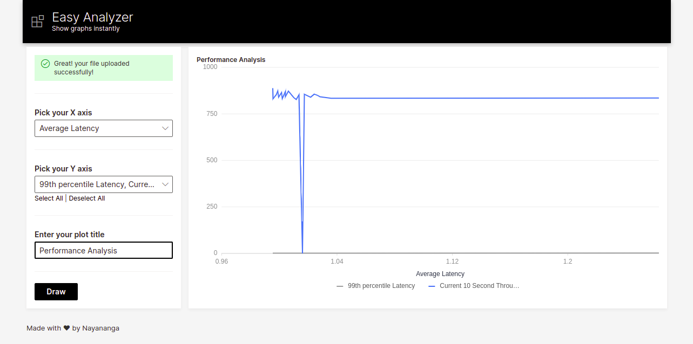

# Wave Easy Data Analyzer

This application allows you to upload and analyze any data set using easy 2d line charts.




## Running this App Locally

### System Requirements

1. Python 3.6+
2. pip3

### 1. Run the Wave Server

New to H2O Wave? We recommend starting in the documentation to [download and run](https://h2oai.github.io/wave/docs/installation) the Wave Server on your local machine. Once the server is up and running you can easily use any Wave app.

### 2. Setup Your Python Environment

```bash
git clone https://github.com/Nayananga/easy-analyzer.git
cd easy-analyzer
python3 -m venv venv
source venv/bin/activate
pip install -r requirements.txt
```

### 3. Configure the App
You need to set your WAVE SDK installation path in ```config.py```

### 4. Run the App

```bash
 wave run easy_ana
```

Note! If you did not activate your virtual environment this will be:

```bash
./venv/bin/wave run easy_ana
```

### 5. View the App

Point your favorite web browser to [localhost:10101/easy_ana](http://localhost:10101/easy_ana)
